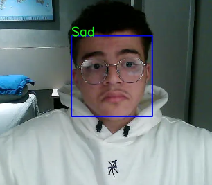

# Data Scientist
 

## Work Experience
**Data Scientist @ Sirros IoT (September 2021 - Present)**
- Develop indoor positioning systems based on BLE beacons using Neural Networks and Trilateration algorithms.
- Develop Computer Vision systems for Steel industry.
- Develop Neural Networks for Computer Vision solutions with Tensorflow.
- Python, MongoDB, Tensorflow, Scikit-learn, Numpy, Pandas, OpenCV and Matplotlib.

**Web Developer Internship @ Sirros IoT (November 2020 - September 2021)**
- Develop new features and maintain ERP system
- C#, JavaScript and SQL

## Education
Technician in Computer Science - Technological and Communication Axis | Synodal Center of Novo Hamburgo Education Unit of the Evangelical Foundation **(January 2020 - November 2021)**

## Projects

### **Applying Computer Vision to a Drawing Game** ###
[Publication](https://blog.devgenius.io/applying-computer-vision-to-a-drawing-game-15a0f961fcfa)

Used The Quick, Draw! Dataset from Google to build a **CNN** to predict which object the person drew. Using the webcam, our hands are the cursor to play the game, within the objective to make the Neural Network to guest which object you drew, given a certain object by the system. The user can select a pen, rubber among other things to draw in the screen.

### **Facial Expression Recognition with TensorFlow** ###
[Publication](https://medium.com/dev-genius/facial-expression-recognition-with-tensorflow-90f6174163c3)

Used Tensorflow and OpenCV to build a **CNN** and an algorithm that can detect people's emotions through facial expressions.

  

## English experience
- 40 hours In-person Engligh Language Course in **Toronto, Canada** at Hansa Language Centre.
- 34 hours of English conversation practice with Cambly's native English teachers.
